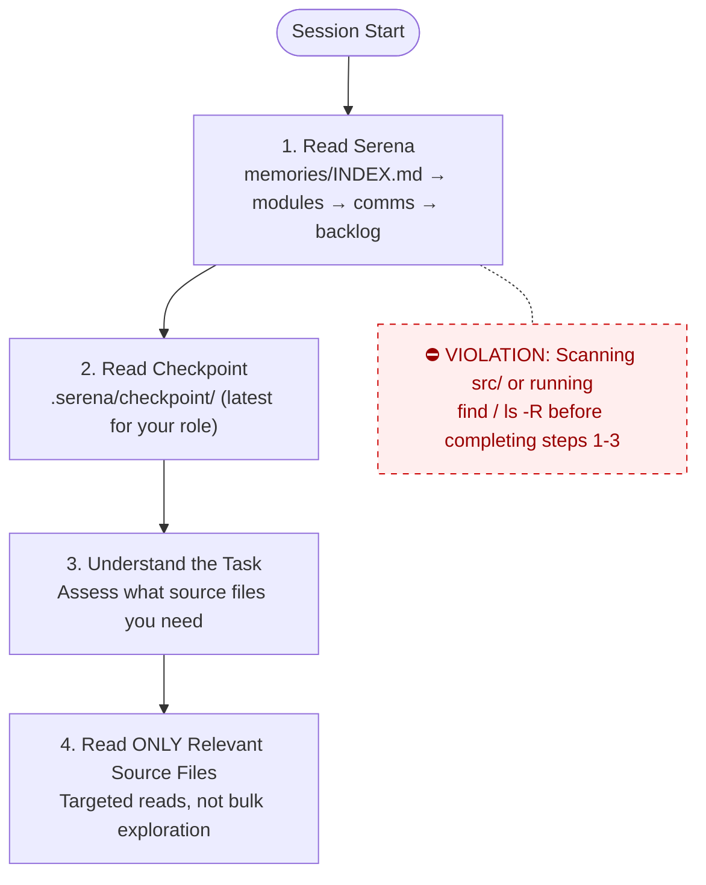
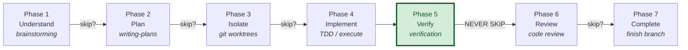
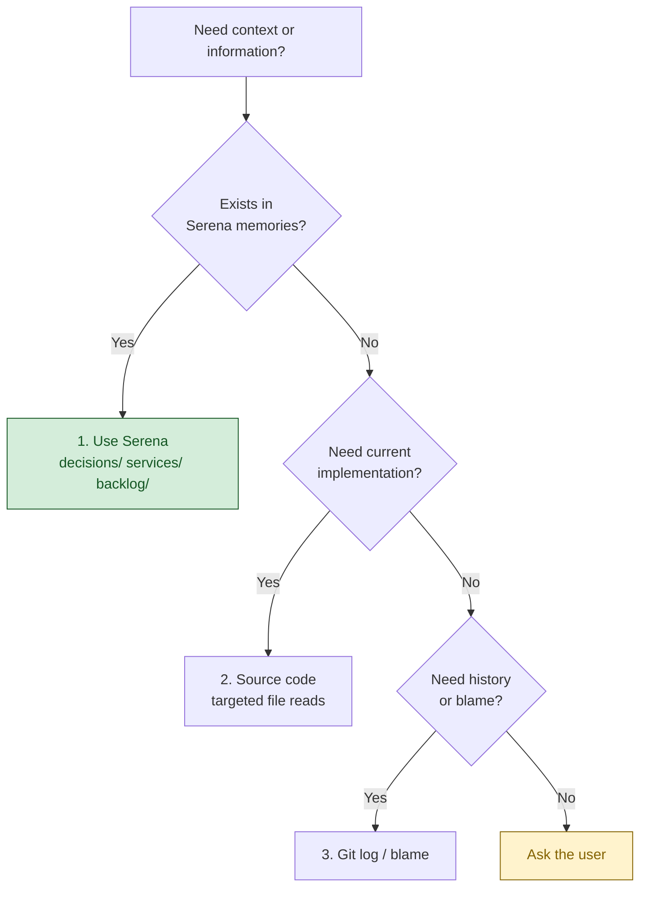
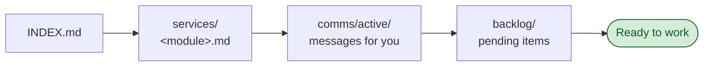
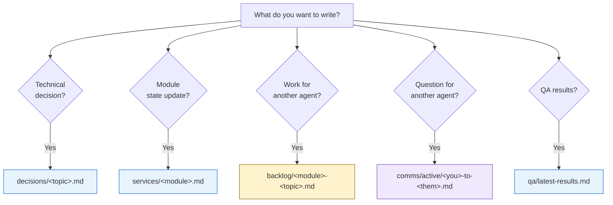

# CLAUDE.md

This file provides guidance to Claude Code (claude.ai/code) and other AI agents when working with code in this repository.

## Project Overview

**LAAM (Local AI Agent Monitoring)** is an internal web tool that lets a developer team watch **Claude AI agents** running on their local machine in real time — with no changes to the agents themselves. It reads the JSONL transcripts that Claude Code / the Agent SDK write to `~/.claude/projects/`, groups them by **project**, and shows each agent: which orchestrator it belongs to, its status, how long it has run, and what it is currently working on.

As of **v0.9.0** LAAM expanded from a pure monitor into a **local-first daily-work assistant**: real-time monitoring, a multimodal local-model **chat assistant**, and **connectors** to external apps — all running locally, with the local model free ($0). The next milestone (→ v1.0.0) is the connector framework.

Canonical documentation: `README.md` (Vietnamese) and `CHANGELOG.md`.

## Tech Stack

| Layer | Technology |
|---|---|
| Runtime | Node.js ≥ 18 (ESM) |
| Server | Express + Server-Sent Events (live updates) |
| File watching | chokidar |
| Frontend | Vanilla JS + HTML + CSS — **no build step**, no framework |
| Charts | Chart.js (dashboard + chat) |
| Graph | vis-network |
| Maps | Leaflet + OpenStreetMap (Nominatim geocode, OSRM routing) |
| Markdown render | marked + DOMPurify (XSS-safe) |
| PDF | jsPDF (export), pdf.js (read) |
| Icons | Lucide (vendored offline) |
| Local LLM | Ollama (GPU) behind a logging proxy (`proxy/server.js`) |
| OCR | Tesseract (vie + eng + chi_sim) for images / scanned PDFs |
| i18n | Lightweight in-house engine — Vietnamese / English / 中文 |
| Persistence | **None server-side** — reads transcript files from disk; chat history lives in browser `localStorage`; connector creds in `~/.laam/connectors.json` (mode 600) |
| Tests | Node built-in test runner (`node test/run.mjs`) |
| Infra | Docker Compose (Ollama + proxy + LAAM); macOS override keeps Ollama native for GPU |

All frontend libraries are **vendored offline** in `public/vendor/` (no CDN calls). Runtime npm dependencies are intentionally minimal: `express`, `chokidar`.

> Note: this is the **current** stack. A SaaS / multi-user direction (Postgres, auth, per-user data) is being planned separately — see `docs/` for v2 planning. Do not assume those exist in the code yet.

## Architecture

Two data sources feed the same UI:
1. **Claude Code transcripts** — `~/.claude/projects/<encoded-cwd>/<sessionId>.jsonl`
2. **Local-model logs** — written by the Ollama logging proxy to `~/.laam/local-logs/<session>.jsonl`

Data flow:

```
~/.claude/projects/…jsonl ─┐
                           ├─► lib/parser.js · lib/localParser.js   (parse, group by project, detect Task/sub-agents, status & timing)
~/.laam/local-logs/…jsonl ─┘
        │
        ▼
   bin/laam.js   ── Express API + SSE; chokidar watches files; serves pages & /api/*
        │
        ▼
   lib/stats.js  ── aggregate cost / tool leaderboard / heatmap / model comparison
        │
        ▼
   public/       ── vanilla-JS pages (no build step)
```

### Backend (`lib/`)
- `parser.js` — parse & analyse Claude Code JSONL (per-tool stats, histograms, tool-call timing, sub-agent detection)
- `localParser.js` — parse local-model proxy logs (the second data source)
- `stats.js` — aggregate metrics for `/api/stats`
- `search.js` — full-text transcript search
- `pricing.js` — manual USD price table per model (**may be stale — edit by hand**; local model = $0)
- `connectors/` — self-registering connector modules (one file per service)

### Frontend (`public/`) — pages

| Route | Page | Purpose |
|---|---|---|
| `/` | Dashboard | KPIs + charts (status / model / branch), cost, hour×weekday heatmap, tool leaderboard, model comparison; CSV/PDF export |
| `/agents` | Agents | Real-time agents grouped by project; filters (project / model / status / branch / time); stuck-agent badge + browser notification; per-session cost; CSV export |
| `/graph` | Graph | orchestrator → sub-agent network (vis-network) |
| `/search` | Search | full-text search across transcripts |
| `/session?id=…` | Session detail | one session + tool-call waterfall |
| `/chat` | Chat | chat with a local Ollama model (streamed through the proxy → tracked as a local source); model picker + temperature / top-p / system prompt; multi-conversation history; file & URL attachments; OCR; location-awareness; rich render (tables, Chart.js charts, Leaflet maps); connector tool-calling; export MD/JSON |
| `/connectors` | Connectors | manage external-app connections (token / OAuth-token); connect / disconnect / test |
| `/office` | Office | isometric "agents office" — rooms per project, agents move/pair, drag to rotate, toggleable HUD |

The chat page uses a **kernel + module** architecture: `chat.js` builds `window.LAAMChat`, then initialises feature modules registered in `window.LAAM_CHAT_MODULES` (`chat-history.js`, `chat-composer.js`, `chat-settings.js`, `chat-export.js`, `chat-ux.js`, `chat-actions.js`, plus the `chat-render` / `chat-geo` / `chat-ingest` helpers). Modules must not run logic at load time beyond registering themselves. Note: chat layout CSS (`.chat-sub`, `.chat-toolbar`, `.dock`, …) is **injected by these JS modules**, not in `styles.css`.

### Connectors
Each connector is a self-registering file in `lib/connectors/` exposing **tools** the chat model can call. When a connector is connected, `/api/chat` runs a tool-calling loop: model calls a tool → backend executes the real API with the user's credential → result is fed back for the model to render. Credentials are stored **server-side only** in `~/.laam/connectors.json` (mode 600), masked on display, never committed. Available: **GitHub** (PAT; public repos work without a token), **Trello** (key+token), **Jira** (email + API token), **Google Drive / Calendar / Gmail** (paste OAuth access token; full OAuth flow planned), plus a credential-free **Demo**. LAAM never logs in on the user's behalf.

### Key API endpoints
`GET /api/sessions`, `GET /api/session/:id`, `GET /api/stats`, `GET /api/search?q=`, `GET /api/config`, `GET /api/events` (SSE), `GET /api/health`, `POST /api/chat`, `GET /api/chat/info`, `GET /api/ollama/models`, `GET /api/connectors`, plus map helpers (`/api/geocode`, `/api/route`, `/api/reverse`, `/api/nearby`) and `/api/fetch-url` (SSRF-guarded).

## Language Notes

The UI and documentation are primarily **Vietnamese**, with English and 中文 available through the i18n engine. `README.md` and `CHANGELOG.md` are written in Vietnamese. When adding user-facing strings, add keys to the relevant `i18n.*.js` files for **all three** languages (vi / en / zh) — they cover every page.

## Workflow Rules

@AGENTS.md

### Session Boot Protocol

**Every agent MUST follow this exact sequence at session start.**
DO NOT read source code, explore directories, or scan the codebase
until you have completed steps 1-3. Source code is a last resort,
not a starting point.

1. **Read Serena** — `memories/INDEX.md` → relevant module memories → `comms/active/` → `backlog/`
2. **Read checkpoint** — `.serena/checkpoint/` for the most recent checkpoint from your role
3. **Understand the task** — you now have project context. Only NOW assess what source files you need.
4. **Read ONLY the source files relevant to your task** — targeted reads, not bulk exploration.



**Violations**: Scanning `src/`, or running `find` / `ls -R` at session start before completing steps 1-3 is a protocol violation. It wastes tokens and ignores existing knowledge.

### Superpowers Workflow

Every agent session follows this structured workflow.
Phases may be skipped for trivial tasks (< 3 steps, single file, obvious fix).
When skipping, state which phases you're skipping and why.

#### Phase 1 — Understand
**Skill**: `superpowers:brainstorming`
**When**: Creating features, modifying behavior, adding functionality.
**Skip if**: Bug fix with clear reproduction, typo, config change.
**Output**: Approved design in `docs/superpowers/specs/`

#### Phase 2 — Plan
**Skill**: `superpowers:writing-plans`
**When**: Task requires 3+ steps or touches multiple files/services.
**Skip if**: Single-file change with obvious implementation.
**Output**: Implementation plan with success criteria per step.

#### Phase 3 — Isolate
**Skill**: `superpowers:using-git-worktrees`
**When**: Feature work that should not pollute the working branch.
**Skip if**: Hotfix, docs-only change, or user requests in-place work.
**Output**: Isolated worktree or branch ready for implementation.

#### Phase 4 — Implement
**Skills** (use as needed):
- `superpowers:test-driven-development` — write tests first, then implementation
- `superpowers:executing-plans` — execute the plan from Phase 2
- `superpowers:dispatching-parallel-agents` — 2+ independent tasks
- `superpowers:subagent-driven-development` — delegate to specialized agents
- `superpowers:systematic-debugging` — when encountering failures during implementation
**Output**: Working code with tests.

#### Phase 5 — Verify
**Skill**: `superpowers:verification-before-completion`
**When**: ALWAYS. This phase is never skipped.
**Output**: Evidence that success criteria are met (test output, build output).

#### Phase 6 — Review
**Skill**: `superpowers:requesting-code-review`
**When**: Feature work, significant changes, anything touching shared code.
**Skip if**: Docs-only, config-only, or user explicitly waives review.
**Output**: Review feedback addressed.

#### Phase 7 — Complete
**Skill**: `superpowers:finishing-a-development-branch`
**When**: Implementation verified and reviewed.
**Output**: PR created, branch merged, or completion option presented to user.

#### Workflow Diagram



#### On-Demand Skills (any phase)
- `superpowers:systematic-debugging` — when hitting unexpected failures
- `superpowers:receiving-code-review` — when receiving feedback from others
- `superpowers:writing-skills` — when creating/modifying workflow skills

### Task Complexity Guide

| Complexity | Example | Required Phases |
|-----------|---------|-----------------|
| **Trivial** | Fix typo, update config value | Implement → Verify |
| **Simple** | Single-file bug fix, add field | Plan → Implement → Verify |
| **Medium** | New endpoint, new component | Plan → Implement → Verify → Review |
| **Complex** | New feature across services | ALL phases |

### Knowledge Source Priority

Agents MUST consult existing knowledge before exploring source code.

#### Retrieval order (strict)



1. **Serena memories** — primary source for decisions, architecture context, conventions, and inter-agent communication
2. **Source code / git log** — when you need exact current implementation details

#### When to read from Serena

| Moment | Action |
|--------|--------|
| Session start | Read `memories/INDEX.md` — understand what's been decided, what's in progress |
| Before coding a function | Check `services/<module>.md` — check related decisions and conventions |
| Before making a design decision | Search `decisions/` — check for prior decisions on same topic |
| When encountering unfamiliar code | Check memories — there may be a decision or discovery explaining it |

#### When to write to Serena

| Moment | Action |
|--------|--------|
| After making a design decision | Write to `memories/decisions/<topic>.md` |
| After discovering something non-obvious | Write to `memories/decisions/<topic>.md` |
| After completing a task | Update checkpoint + relevant service memory |
| When identifying work for another agent | Write to `memories/backlog/<service>-<topic>.md` |

### Mandatory Session Checkpoint

**All AI agents MUST write a checkpoint file at the end of every session** to `.serena/checkpoint/`.

**Format**: `.serena/checkpoint/<agent-name>-<YYYY-MM-DD>.md`

**Required content**:
```markdown
# Checkpoint: <agent-name> — <date>

## What was done
- <bullet list of completed work>

## Files changed
- <list of files created/modified/deleted>

## Current state
- <what is working, what is broken, what is partially done>

## Next steps
- <what the next session should pick up>

## Blockers / Risks
- <anything that could block progress>
```

**Rules**:
- Write checkpoint BEFORE ending the session — no exceptions
- If the session was interrupted or failed, still write a checkpoint noting the failure
- One file per agent per day; append if multiple sessions in the same day
- Keep each checkpoint concise (under 50 lines)
- This applies to ALL agents: any subagents, specialized agents, or the main session agent

### Serena Memory Protocol

Serena is the project's knowledge store for decisions, conventions, service state, and inter-agent communication.
All agents MUST follow these rules when reading/writing to `.serena/memories/`.

#### Read Protocol — Session Start



1. Read `memories/INDEX.md` first
2. Read `services/<your-module>.md` for current state
3. Check `comms/active/` for messages addressed to you
4. Check `backlog/` for pending action items in your domain

#### Write Protocol — What goes where



| You want to... | Write to | Naming |
|----------------|----------|--------|
| Record a technical decision | `decisions/<topic>.md` | Descriptive topic name |
| Update module/service state | `services/<module>.md` | Append or replace section |
| Flag work for another agent | `backlog/<module>-<topic>.md` | Prefix with target module |
| Ask another agent a question | `comms/active/<you>-to-<them>-<topic>.md` | |
| Respond to a question | Append to the existing file in `comms/active/` | |
| Close a resolved thread | Move both files to `comms/resolved/` | |
| Report QA results | `qa/latest-results.md` (replace) | Keep only latest |
| Store something historical | `archive/<category>/` | |

#### Rules

- **Never create new top-level directories** under `memories/`
- **Never put files directly in `memories/`** — always in a subdirectory
- **1 file per module** in `services/` — update, don't create siblings
- **Backlog items**: delete the file when the work is done
- **Comms**: respond within the SAME file (append), don't create
  a separate response file. Move to `resolved/` when done.
- **Decisions**: only for choices that affect future work. Don't store
  implementation details — those belong in code comments.
- **Update INDEX.md** when adding new files to `decisions/` or `services/`
- **QA**: `latest-results.md` is overwritten each run. Archive old
  results to `archive/qa-runs/<date>.md` before overwriting.

## Documentation

`README.md` is the canonical project documentation and is written in **Vietnamese**; keep it in sync when behaviour changes. `CHANGELOG.md` follows [Keep a Changelog](https://keepachangelog.com) + SemVer — record notable changes under `[Unreleased]`. Additional design notes live in `docs/`.

## Build & Run Commands

```bash
npm install                       # install deps (express, chokidar)
npm start                         # start server → http://localhost:4317
npm run dev                       # start with Node --watch (auto-restart)
npm test                          # run tests (node test/run.mjs)

# CLI flags / env vars
npm start -- --port 8080          # change port (default 4317)                 [LAAM_PORT]
npm start -- --dir /path          # projects dir to watch                      [LAAM_PROJECTS_DIR]
npm start -- --local /path        # local-model logs dir (~/.laam/local-logs)  [LAAM_LOCAL_LOGS]
npm start -- --stuck 15           # stuck-agent threshold in minutes (def. 10) [LAAM_STUCK_MIN]

# Local model (free, $0): install Ollama, then
ollama pull qwen3-vl:8b
node proxy/server.js              # logging proxy :11435 → Ollama :11434 (logs → ~/.laam/local-logs)

# Docker
docker compose build && docker compose up -d                                   # Linux / CPU — full stack
ollama serve &                                                                 # macOS: keep Ollama native (GPU)…
docker compose -f docker-compose.yml -f docker-compose.macos.yml up -d --build # …run proxy + LAAM in Docker
```

No build step and no database are required to run LAAM.
