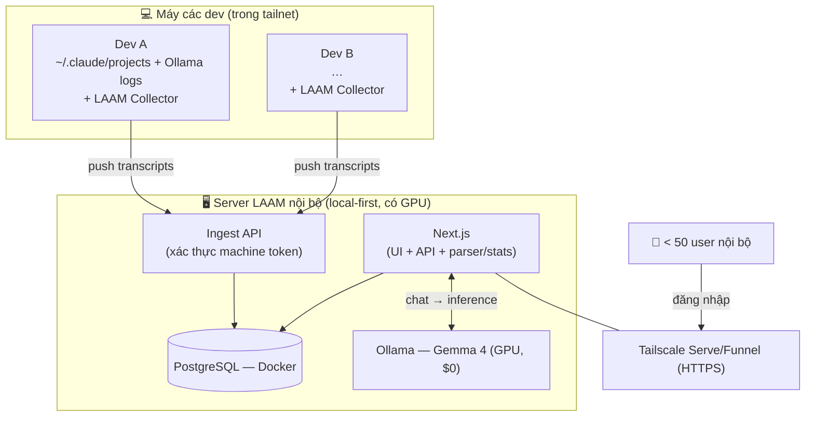
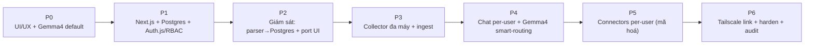

# LAAM v2 — Kế hoạch triển khai (BẢN CHỐT)

> Trạng thái: **✅ Đã chốt — sẵn sàng triển khai** · Ngày: 2026-06-03 · Hướng tới: **v2.0.0**
> **Định hướng:** giữ LAAM **chạy local**, hiện đại hoá tech stack (**Next.js + Postgres + Auth.js + RBAC + data theo user**), giám sát **đa máy** trong nội bộ, model **Gemma 4** chủ đạo, mở link cho **<50 người nội bộ** qua **Tailscale** — **KHÔNG** host cloud theo mô hình SaaS.

---

## 0. Tóm tắt quyết định (đã khoá)

| Hạng mục | Quyết định cuối |
|----------|-----------------|
| Mô hình chạy | **Local-first**, 1 server nội bộ + collector trên từng máy dev (tailnet) |
| Giám sát | **Đa máy** — mỗi máy chạy collector đẩy transcript về server trung tâm |
| Frontend | **Next.js 16** (App Router, React 19, TypeScript) |
| Persistence | **PostgreSQL** (Docker, local) |
| ORM | **Drizzle** |
| Auth | **Auth.js (NextAuth)** + RBAC — *không dùng Supabase* |
| Realtime | **SSE** (giữ như hiện tại) |
| Model | **Gemma 4 (`gemma4:e4b`) mặc định** + **smart-routing** sang tool-caller khi cần connector |
| Inference | **Ollama local** trên server trung tâm ($0) |
| Mở link nội bộ | **Tailscale Serve/Funnel** (HTTPS), auth vẫn bắt buộc |
| Quy mô | **< 50 user nội bộ** |
| Cô lập data | Giám sát = chia sẻ tổ chức (gate theo role); chat + connector creds = **riêng từng user (mã hoá)** |

Các mục vận hành cũng đã chốt (xem §12): retention `events`, migrate dữ liệu cũ, concurrency GPU.

---

## 1. Định hướng

LAAM v2 **bỏ hướng cloud SaaS**, giữ tinh thần local-first nhưng nâng cấp để **nhiều người nội bộ** dùng chung và **giám sát nhiều máy**:

- **1 server LAAM nội bộ** (máy mạnh có GPU) chạy Next.js + Postgres + Ollama (Gemma 4).
- **Collector** gọn nhẹ trên từng máy dev → đẩy transcript Claude + log Ollama local về server (trong **tailnet**).
- Người nội bộ **đăng nhập** qua link Tailscale, xem giám sát đa máy + dùng chat assistant (Gemma 4) + connectors cá nhân.

**So với bản SaaS đã gỡ:** không cloud, không relay inference (server gọi thẳng `localhost` Ollama), không multi-tenant nhiều org. Collector chỉ đẩy **dữ liệu giám sát** trong mạng nội bộ — đơn giản hơn nhiều so với agent cloud.

---

## 2. Kiến trúc tổng thể

- **Server trung tâm:** một app Next.js (UI + route handlers), Postgres (Docker), Ollama (Gemma 4). Parser/stats (`lib/parser.js`, `lib/stats.js` tái dùng) chạy ở server.
- **Inference** chỉ ở server (GPU dùng chung) → đơn giản, không cần GPU ở máy dev.
- **Collector** trên máy dev: chỉ đẩy **dữ liệu giám sát**, không liên quan inference.
- **Tailscale** mở link nội bộ; **auth bắt buộc** (mạng không thay cho auth).

---

## 3. Collector đa máy

Thành phần **mới**, gọn nhẹ, chạy trên mỗi máy dev cần giám sát:

- **Đăng ký:** admin tạo **pairing code** trong UI → chạy `laam-collector pair <code>` → nhận **machine token** (lưu **hash** ở server, gắn máy với 1 owner).
- **Theo dõi & đẩy:** watch `~/.claude/projects/*.jsonl` (+ log Ollama local nếu có) → đẩy **dòng JSONL mới** (hoặc đã parse) lên `Ingest API` qua HTTPS tailnet, kèm token.
- **Chịu lỗi mạng:** hàng đợi tại chỗ, gửi lại khi reconnect.
- **Bảo mật:** token revoke được từng máy; ingest chỉ nhận token hợp lệ; scope theo máy/owner.
- **Đóng gói:** script Node nhỏ / binary; cài như dịch vụ nền (launchd/systemd). Tái dùng phần lớn logic đọc file đã có.

> Parser nên chạy **ở server** (collector chỉ đẩy raw + metadata) để logic phân tích tập trung, dễ nâng cấp.

---

## 4. Mô hình dữ liệu (PostgreSQL)

> Auth.js dùng bảng `sessions` cho phiên đăng nhập → bảng giám sát đặt tên **`agent_sessions`**.

| Nhóm | Bảng | Cột chính / ghi chú |
|------|------|---------------------|
| Auth (Auth.js) | `users`, `accounts`, `sessions`, `verification_tokens` | Chuẩn Auth.js (Drizzle adapter) |
| Phân quyền | cột `role` trên `users` (hoặc `user_roles`) | `owner`/`admin`/`member`/`viewer` |
| Máy | `machines` | id, name, hostname, `owner_user_id`, `token_hash`, last_seen, created_at |
| Giám sát (chia sẻ, gate role) | `projects` | id, encoded_cwd, name |
| Giám sát | `agent_sessions` | id, **machine_id**, project_id, claude_session_id, model, source(`claude`/`local`), status, started_at, last_activity, tokens, cost |
| Giám sát | `events` | id, agent_session_id, ts, role, type, tool_name, payload `jsonb` — **phân vùng theo tháng + retention** |
| Per-user (riêng tư) | `chat_conversations`, `chat_messages` | theo `user_id`; thay `localStorage` |
| Per-user (mã hoá) | `connector_credentials` | `user_id`, connector_id, `secret_encrypted` — thay `~/.laam/connectors.json` |
| Vết | `audit_log` | user_id, action, target, ts |

**Phân loại truy cập:** giám sát (machines/agent_sessions/events) **chia sẻ trong tổ chức**, lọc được theo máy/owner, gate theo role; chat + connector creds **riêng từng user**.

---

## 5. Authentication & phân quyền

- **Auth.js (NextAuth)** + adapter Postgres (Drizzle): email/password hoặc OAuth (Google/GitHub) tuỳ nội bộ.
- **RBAC:** `owner` (toàn quyền + quản user + pairing máy), `admin` (quản connector cấp tổ chức, cấu hình), `member` (xem giám sát + sở hữu chat/connector cá nhân), `viewer` (chỉ đọc giám sát).
- **Cô lập data per-user:** middleware lấy user từ session → mọi truy vấn Drizzle **scope theo `user_id`/role**; bảng riêng tư không trả chéo user. (Tuỳ chọn bật **Postgres RLS** với `SET app.user_id` làm lớp phòng thủ thứ hai.)
- **Xác thực collector:** tách khỏi Auth.js — `machines.token_hash`; ingest middleware kiểm token; revoke được.

---

## 6. Model Gemma 4 + smart-routing + concurrency

- **Mặc định `gemma4:e4b`** (chat/vision thường ngày), inference local qua Ollama, $0.
- **Smart-routing (đã chốt):** khi hội thoại cần gọi **tool connector**, tự chuyển lượt đó sang model tool-call ổn định (vd `qwen3-vl:8b`); xong quay lại Gemma 4. (Vì gemma4 rớt tool-call ~2/3 lần — lý do từng bị revert ở commit `f1233a0`.)
- **Model theo user/workspace:** lưu lựa chọn mặc định của mỗi người trong Postgres.
- **Concurrency (<50 user):** GPU server dùng chung →
  - giữ model **nạp sẵn** (Ollama keep-alive), tránh cold-start;
  - **hàng đợi** request nhẹ + giới hạn song song hợp lý;
  - `gemma4:e4b` nhỏ/nhanh nên 1 GPU đủ cho đội <50 (không phải tất cả chat cùng lúc). Nếu nghẽn: tăng giới hạn keep-alive hoặc thêm 1 model instance.

---

## 7. Bảo mật & cô lập

- **Connector token mã hoá at-rest** (libsodium/`pgcrypto`), khoá trong biến môi trường server; **mask** khi hiển thị; không trả secret thô ra client.
- **RBAC + scope `user_id`** trên mọi truy vấn; audit log cho hành động nhạy cảm.
- **Machine token** hash, revoke được; ingest chỉ trong tailnet.
- Giữ phòng thủ sẵn có: **DOMPurify** cho HTML từ model, chặn **SSRF** ở fetch URL, User-Agent + throttle geocode.
- **Link nội bộ:** auth bắt buộc kể cả sau Tailscale; cân nhắc giới hạn theo tailnet/email domain tổ chức.

---

## 8. Mở link cho người nội bộ

- **Tailscale Serve** (trong tailnet — chỉ thành viên tổ chức) hoặc **Funnel** (ra Internet, HTTPS hợp lệ). Đã dùng ở v0.9 → **secure context** cho GPS trên điện thoại.
- Thay thế: **Cloudflare Tunnel** nếu không dùng Tailscale.

---

## 9. Tính năng port sang v2

| Tính năng | Hiện tại (v0.9) | v2 |
|-----------|------------------|-----|
| Giám sát (Dashboard/Agents/Graph/Session/Office) | parse file 1 máy, SSE | **đa máy** → Postgres (history), UI Next.js, SSE, lọc theo máy/owner |
| Chat history | `localStorage` 1 trình duyệt | `chat_*` theo user, đồng bộ qua link |
| Inference | Ollama trực tiếp | Ollama server (Gemma 4) + smart-routing tool-call |
| Connectors | `connectors.json` chung | per-user **mã hoá** trong Postgres |
| Search | full-text trên file | full-text Postgres (`tsvector`/pg_trgm) |
| i18n vi/en/zh | engine in-house | giữ nội dung (next-intl hoặc giữ engine) |
| Export CSV/PDF/MD | client | giữ |

---

## 10. UI/UX — sửa ngay trên bản hiện tại (Phase 0)

Sửa trên bản vanilla (giá trị tức thì, rủi ro thấp); rút kinh nghiệm cho bản Next.js:

- **Toolbar đổi chiều cao khi scroll:** CSS chat (`.chat-sub`/`.chat-toolbar`/`.dock`) inject bằng JS; thanh sticky offset cố định `top:57/59px`; nghi do nội dung động reflow + thiếu `min-height` → đặt chiều cao ổn định, `box-sizing` nhất quán, tách phần động khỏi luồng cao-độ.
- **Full-width chưa đúng:** `main{max-width:1500px;margin:auto}` căn giữa trong khi chat/office/graph cần **full-bleed** → layout riêng theo trang.
- **Bố trí nút chat:** rải ở `chat-sub`+`composer-toolbar`+`dock` → gom vào 1 composer mạch lạc, nhóm đính kèm vào menu "+", tăng tap-target mobile.
- **gemma4 default:** đổi `bin/laam.js` (`CHAT_MODEL`) + `public/chat-settings.js` (`DEFAULT_MODEL`) → `gemma4:e4b`.

---

## 11. Lộ trình theo phase

| Phase | Nội dung | Tiêu chí hoàn thành |
|-------|----------|---------------------|
| **0** | Sửa UI/UX; set Gemma 4 default | Hết lỗi toolbar/full-width/chat; gemma4 mặc định |
| **1** | Next.js + Postgres (Docker) + Auth.js + RBAC | Đăng nhập + role; 2 user thấy đúng data riêng (có test) |
| **2** | Parser ghi `agent_sessions`/`events`; port Dashboard/Agents/Graph/Session đọc Postgres | Dashboard khớp bản local + có history lâu dài |
| **3** | **Collector đa máy** + Ingest API (machine token) | ≥2 máy đẩy data; UI lọc theo máy/owner; token revoke được |
| **4** | Chat per-user trong Postgres; Gemma 4 + smart-routing | Chat lưu theo user; tool-call vẫn chạy khi cần connector |
| **5** | Connectors per-user mã hoá at-rest | User A không thấy token user B; GitHub/Jira chạy thật |
| **6** | Mở link Tailscale; hardening; audit log | Người nội bộ vào qua link, auth bắt buộc, có vết; thử tải <50 user |

---

## 12. Vận hành (đã chốt)

- **Retention `events`:** phân vùng theo **tháng**; giữ chi tiết đầy đủ **90 ngày** (cấu hình qua env), sau đó **roll-up tóm tắt** + archive tuỳ chọn. `agent_sessions` (nhẹ) giữ dài hạn.
- **Migrate dữ liệu cũ:**
  - `connectors.json` → **script một lần** gán cho 1 admin chỉ định, mã hoá per-user; admin re-assign/chia sẻ sau.
  - chat `localStorage` → dùng **Export sẵn có** rồi **Import** vào tài khoản (không tự động vì theo trình duyệt).
- **Concurrency GPU (<50 user):** keep-alive model + hàng đợi nhẹ; 1 GPU đủ; có đường mở rộng nếu nghẽn (xem §6).

---

## 13. Rủi ro kỹ thuật còn lại & bước tiếp theo

**Rủi ro (không phải quyết định mở — cần theo dõi khi làm):**
- Khối lượng `events` lớn theo thời gian → đã có retention/phân vùng, cần đo thực tế.
- Chất lượng tool-call của Gemma 4 → đã có smart-routing; cần test connectors thật.
- Đồng bộ collector ↔ server khi mạng chập chờn → hàng đợi + idempotent ingest.
- Tải GPU lúc cao điểm <50 user → đo và chỉnh keep-alive/queue.

**Bước tiếp theo:** bắt đầu **Phase 0** (UI/UX + Gemma 4 default) trên bản hiện tại, song song dựng **Phase 1** (Next.js + Postgres + Auth.js/RBAC).

> Phiên bản tham khảo (06/2026): Next.js 16.2.7 (App Router/Turbopack mặc định, React 19.2); Drizzle (SQL-first, ~7.4kb); Auth.js (auth nhúng trong Next.js); Ollama phục vụ Gemma 4 local ($0).
